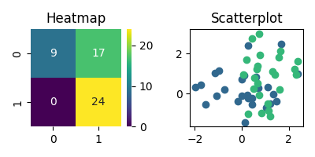
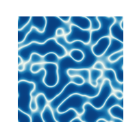

# excolors

## Extexnded color utilities for python
#

# Installation
```
pip install excolor
```


# Extra colormaps

```
cmap = plt.get_cmap("gruvbox")
cmap
```


# Color cycler

Set ax color cycler based on cmap or list of colors

```
from sklearn.metrics import confusion_matrix

# Generate data for heatmap and scatter plot
np.random.seed(10)
y_true = (np.arange(50) > 25).astype(float)
x0 = np.random.normal(0,1,50) + y_true
x1 = np.random.normal(0,1,50) + y_true

# Predict y_true based on x0
y_pred = x0 > 0
c = confusion_matrix(y_true, y_pred)

# Plot heatmap of confusion matrix using "viridis" colormap
plt.figure(figsize=(4,2), facecolor="white")
plt.subplot(121)
plt.title("Heatmap")
sns.heatmap(c, annot=True, cmap="viridis", vmin=0)
plt.subplot(122)
plt.title("Scatterplot")

# Set "viridis" colors for color cycler to make scatter plot
excolor.set_color_cycler("viridis", n=2)
for i in range(2):
    mask = y_true == i
    plt.scatter(x0[mask], x1[mask])
plt.tight_layout()
plt.show()


```



# Log-scaled colormap

Color perlin noise using log-scaled colormap to visualize water caustics

```
from pythonperlin import perlin

dens = 32
shape = (8,8)
x = perlin(shape, dens=dens)

# Log-scaled colormap
cmap = excolor.logscale_cmap("GnBu_r")

plt.figure(figsize=(6,6), facecolor="#00000000")
plt.imshow( np.abs(x), cmap=cmap)
plt.axis("off")
plt.show()
```



