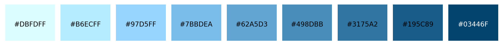
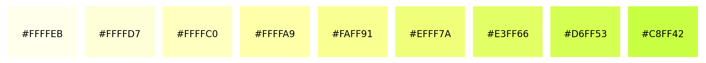

excolor
=======

Extended color utilities for python.

Installation
------------

.. code-block:: bash

   pip install excolor

Quick start
-----------

Generate primary colors palette from a seed color
~~~~~~~~~~~~~~~~~~~~~~~~~~~~~~~~~~~~~~~~~~~~~~~~~

.. code-block:: python

   import excolor

   # Seed color
   color = '#70B3E0'

   # Generate a palette for primary CSS colors
   primary_colors = excolor.generate_primary_palette(color, mode='superellipse', power=3)

   # Show primary colors
   excolor.show_colors(primary_colors)

.. raw:: html

   

   /* Snap color palette */
   :root {
     --primary-color-1: #DBFDFF;
     --primary-color-2: #B6ECFF;
     --primary-color-3: #97D5FF;
     --primary-color-4: #7BBDEA;
     --primary-color-5: #62A5D3;
     --primary-color-6: #498DBB;
     --primary-color-7: #3175A2;
     --primary-color-8: #195C89;
     --primary-color-9: #03446F;
   }
   

Generate foreground colors palette from a seed color
~~~~~~~~~~~~~~~~~~~~~~~~~~~~~~~~~~~~~~~~~~~~~~~~~~~~~~

.. code-block:: python

   import excolor

   # Seed color
   color = '#BBFF33'

   # Generate a palette for primary CSS colors
   foreground_colors = excolor.generate_foreground_palette(color)

   # Show primary colors
   excolor.show_colors(foreground_colors)

.. raw:: html

   

   /* Pale Canary color palette */
   :root {
     --foreground-color-1: #FFFFEB;
     --foreground-color-2: #FFFFD7;
     --foreground-color-3: #FFFFC0;
     --foreground-color-4: #FFFFA9;
     --foreground-color-5: #FAFF91;
     --foreground-color-6: #EFFF7A;
     --foreground-color-7: #E3FF66;
     --foreground-color-8: #D6FF53;
     --foreground-color-9: #C8FF42;
   }
   

.. toctree::
   :maxdepth: 2
   :caption: Contents:

   Home <self>

.. toctree::
   :maxdepth: 2
   :caption: Examples

   notebooks/examples

.. toctree::
   :maxdepth: 2
   :caption: Image Tools

   notebooks/imagetools

.. toctree::
   :maxdepth: 2
   :caption: Wallpapers

   notebooks/wallpapers

.. toctree::
   :maxdepth: 2
   :caption: API Reference

   api/modules

